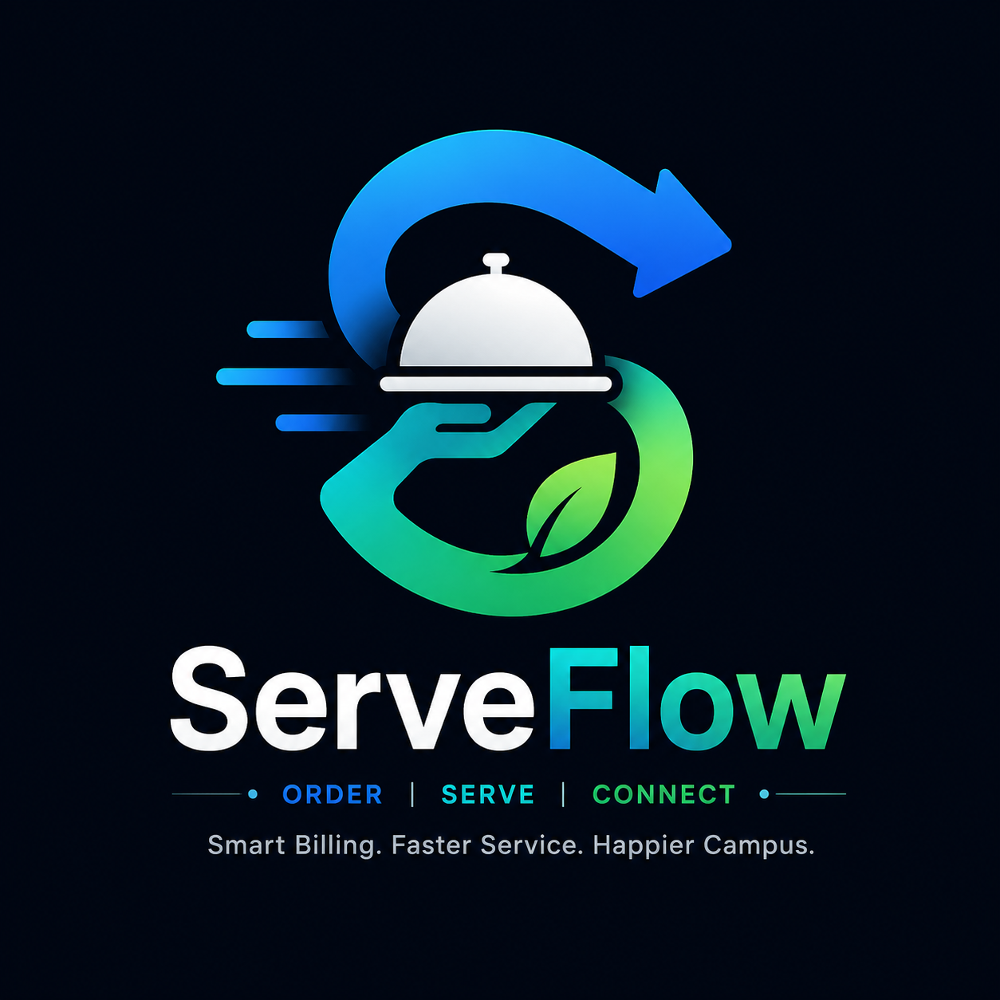

<div align="center">
  
  <h1>Serve Flow</h1>
  <p><strong>A Next-Generation Automated Canteen Billing & Token Management Platform</strong></p>
</div>

<br />

ServeFlow is a comprehensive, dual-portal web application designed to eliminate canteen queues, automate UPI payment matching, and seamlessly bridge the gap between walk-in customers and online pre-orders.

---

## 🚀 Key Features

### 🏢 QuickBill (Biller Portal)
- **Live UPI Matching Engine**: Instantly and automatically matches walk-in Razorpay static QR payments to generated bills using dynamic time windows.
- **Ambiguous Match Resolution**: Intelligently detects identical payments arriving simultaneously and prompts the biller to resolve them via the last 4 digits of the UPI reference.
- **ESC/POS Thermal Printing**: Connects directly to local network thermal receipt printers via TCP sockets for instant, hardware-level token printing.
- **Virtual Print Fallback**: Automatically provides an on-screen, perfectly isolated printable browser token if the physical printer goes offline.
- **Real-Time Live Dashboard**: Utilizes Server-Sent Events (SSE) and asynchronous Multithreading (Spring Event Publisher) to push instant, real-time UI updates for pending payments and recent tokens without manual refreshing.

### 🎓 Campus Bite (Student Portal)
- **Mobile-First Experience**: A beautifully crafted, responsive UI specifically designed for students on the go.
- **Google OAuth2 Security**: Strict authentication allowing only students with `@sairamtap.edu.in` accounts to log in.
- **Online Pre-Ordering**: Students can browse the menu, add to cart, and checkout online.
- **Razorpay Integration**: Flawless online payment capture and signature verification to guarantee secure transactions.
- **Token Tracking**: Live "My Orders" dashboard tracking order status from PAID to SERVED.

---

## 📸 Screenshots


<br /><br />


<br /><br />

### 🏢 QuickBill Dashboard 


<br /><br />


<br /><br />

### 🎓 Campus Bite Mobile App


<br /><br />


&nbsp;&nbsp;&nbsp;&nbsp;&nbsp;&nbsp;&nbsp;&nbsp;


---

## 💻 Tech Stack

**Backend**
- **Java 17 & Spring Boot 3**: High-performance backend REST APIs.
- **Spring Security**: JWT-based stateless authentication and Google OAuth2 integration.
- **Spring Data JPA & Hibernate**: Robust ORM layer connecting to MySQL.
- **Razorpay SDK**: Webhook signature verification and order creation.
- **Escpos-Coffee**: Hardware-level thermal printer integration.

**Frontend**
- **HTML5 & CSS3**: Pure, lightweight, dependency-free vanilla frontend.
- **Vanilla JavaScript**: ES6+ modules fetching live data and handling UI states.

---

## 🛠️ Setup & Installation

The easiest way to run ServeFlow locally is using **Docker**. The repository includes a `docker-compose.yml` file that instantly spins up both the Spring Boot application and the MySQL database with zero manual configuration.

### 1. Prerequisites
- **Install Docker Desktop:** Download and install [Docker Desktop](https://www.docker.com/products/docker-desktop/) for your operating system (Windows, Mac, or Linux).
- **Ensure Docker is Running:** Open the Docker Desktop app and make sure the engine is running.
- **Clone the Repository:**
  ```bash
  git clone https://github.com/BibiAshik/Serve-Flow.git
  cd Serve-Flow
  ```

### 2. Configure Environment Variables
Before starting the application, you must configure your security keys. 
1. Open the existing `src/main/resources/application.properties` file.
2. Replace the placeholder values with your own secrets (JWT, Google OAuth, and Razorpay API keys):
```properties
# JWT Security
jwt.secret=generate_a_very_long_secure_random_string_here

# Google OAuth2
spring.security.oauth2.client.registration.google.client-id=your_client_id
spring.security.oauth2.client.registration.google.client-secret=your_client_secret

# Razorpay
razorpay.key.id=your_razorpay_key
razorpay.key.secret=your_razorpay_secret
razorpay.webhook.secret=your_webhook_secret
```
*(Note: Database credentials are automatically handled by Docker Compose).*

### 3. Build and Run
Open your terminal, navigate to the root folder of the project, and run:

```bash
docker compose up --build -d
```
Docker will automatically pull the MySQL image, create the `serveflow_db` database, compile the Spring Boot application using the provided `Dockerfile`, and start both containers.

The application will start on `http://localhost:8080`.

### 4. Stop the Application
To safely shut down the application and database, run:
```bash
docker compose down
```

---

## 🌐 Accessing the Portals

- **Biller Login**: `http://localhost:8080/biller/login`
- **Student Portal**: `http://localhost:8080/student/home`


> [!WARNING]
> **Domain Restriction:** By default, the Student Portal Google OAuth2 login is strictly locked to specific College email domains. 
> 
> **How to test with your own email:**
> To allow any Gmail account to log in, simply add this line to the bottom of the `src/main/resources/application.properties` file before running:
> ```properties
> app.college-email-domain=@gmail.com
> ```
> *(Or leave the value completely blank to allow absolutely any Google account).*

---

### 🔒 Live Demonstration (Private)
The application is currently deployed live on Railway for interview and demonstration purposes only. Because this is an internal campus tool, public access is strictly restricted.

- 🍔 **Biller Portal**: [https://serve-flow-production-10.up.railway.app/biller/login](https://serve-flow-production-10.up.railway.app/biller/login)
- 🎓 **Student Portal**: [https://serve-flow-production-10.up.railway.app/student/home](https://serve-flow-production-10.up.railway.app/student/home)

> [!NOTE]
> These live links are provided to prove the production environment is active and also interview demo . However, due to security policies, you will not be able to log in without an authorized college domain account or pre-configured biller credentials.
---
*Developed with ❤️ to modernize campus dining.*
